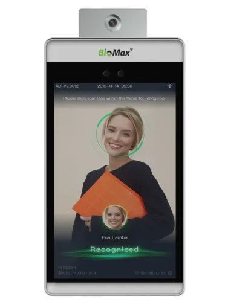

# this-is-me

## This is Me

### Introduction

[https://github.com/vietphan1995/this-is-me.git](https://github.com/vietphan1995/this-is-me.git)

✉️ [Send to email: vietphan95@outlook.com](mailto:vietphan95@outlook.com?subject=register_idea:this-is-me_project&body=left_your_idea)

This is Me is a software social platform that keeps social personal identity as a service. It can run on smart devices which supporting biography/biometric authenticate method.

This is Me uses your reality identity asset to identify you with others in social like faceprint, fingerprint, ADN/DNA as biography; social/credential certificate; working/job certificate; name, address, phone number as local personal identification; This is Me credential point in frequency update cases.

This is Me helps generating attached link for other platforms to manage who interacts with you in active or passive ways as share link or QR-code technology, prevent profile hijackers by tick tock effect.

This is Me social can organize attendance, authorize you or organization in asset thread for many purposes.

.

### [back to git projects …](https://github.com/vietphan1995/projects)

### Notes
https://maianhcorporation.notion.site/this-is-me-24c5e832d6ee8001a0bdf6442d4ce154